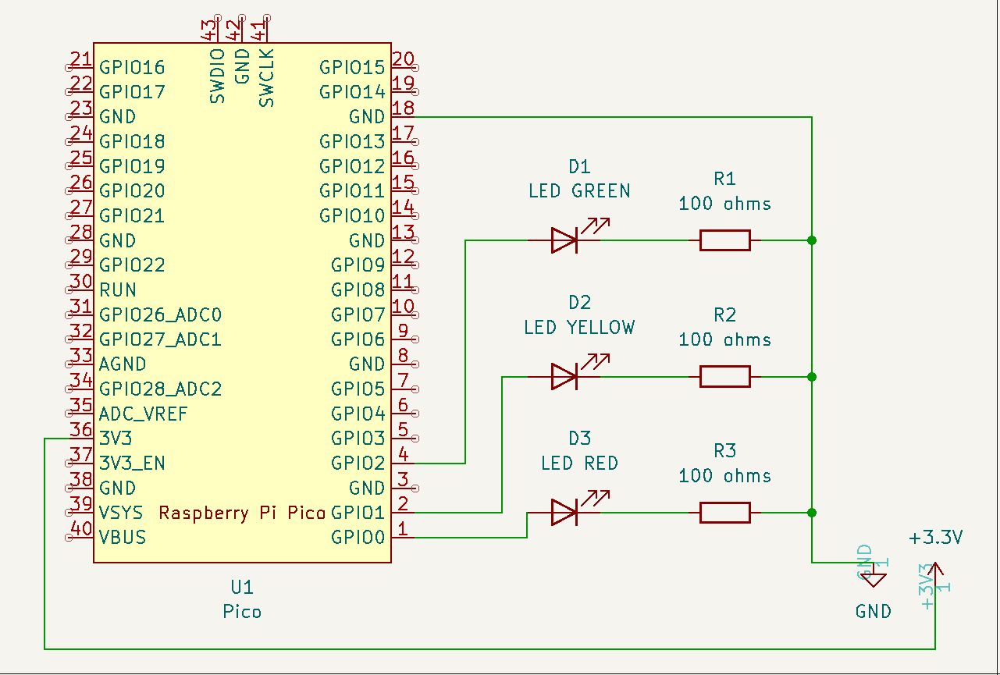

# Traffic Lights

Traffic ligths simulator.

# Parts

- LED (green, yellow, red) x 3
- Resistors(100 ohm) x 3
- Breadboard
- Jumper wires

# Schematic



# Instructions

To start this app:

- Installing Packages

```
pio pkg install
```

- Build Projects

```
pio run
```

- Upload firmware to device:

```
pio run --target upload
```
